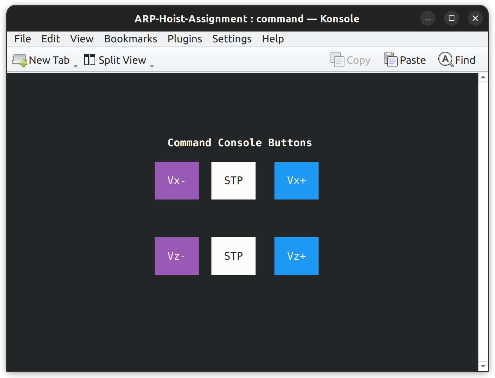

# ARP-Hoist-Assignment
Yassin Farah 4801788
## Description
This first *Advanced and Robot Programming* (ARP) assignment consists in creating a simulation of a port hoist using C programming language. The hoist is controlled by a command window in which there are 6 clickable buttons:

- **_Vx+_** and **_Vx-_** to increment and decrement the speed along the horizontal axis
- **_Vz+_** and **_Vz-_** to increment and decrement the speed along the vertical axis
- two **_STP_** buttons to set the velocity along the two axis to zero




The position of the hoist is graphically shown on a inspection window in which there are 2 clickable buttons:

- **_S_** (stop) to immediately stop the hoist
- **_R_** (reset) to move the hoist back to the initial position, ignoring inputs coming from the command window


## Folders content

The repository is organized as follows:
- the `src` folder contains the source code for all the processes
- the `include` folder contains all the data structures and methods used within the ncurses framework to build the two GUIs

After compiling the program other two directories will be created:

- the `bin` folder contains all the executable files
- the `log` folder will contain all the log files of the processes after the program will be executed

## Processes
The program is composed of 6 processes:

- `command_console.c` creates a window where you can send commands to the two motors, using a ncurses GUI
- `mx.c` is the process related to the motor that makes the hoist move in the horizontal axis and it listens for commands sent by the command window, computes the new x component of the position and, eventually, sends it to the `world.c` process
- `mz.c` does the same thing as `mx.c` but it is related to the motor that makes the hoist move in the vertical axis
- `world.c` gets the position from the two motors processes and applies a 0.5% random error to the measurement, to better simulate what happens in the real case scenarios, and send the position to the `inspection_console.c` process
- `inspection_console.c` gets the position from the `world.c` process and displays the hoist on a window, using ncurses GUI. Furthermore, there are the stop and reset buttons, that, in case they're pressed, send a signal to the motors to respectevely stop or go back to the (0,0) position
- `master.c` is the first process to be executed and it takes care of launching all the other processes and monitor them as a watchdog. In case one of them terminates unexpectedly or none are doing anything (motors not moving, no commands sent, no signals sent...), the master process will kill all the processes and terminate.

## Requirements
The program requires the installation of the **konsole** program and of the **ncurses** library. To install the konsole program, simply open a terminal and type the following command:
```console
$ sudo apt-get install konsole
```
To install the ncurses library, type the following command:
```console
$ sudo apt-get install libncurses-dev
```

## Compiling and running the code
Two shell scripts have been provided to compile and run the code. To compile the code simply open a terminal from inside the directory and type the following command:
```console
$ bash compile.sh
```
To run the code type the following command:
```console
$ bash run.sh
```

## Log files
During the execution of the program, the processes will write information (new motors speed, new position, signals sent...) on their log file, located in the `log` directory. In case of an error, more information on what happened will be available in the log file.
